# 说明

本工程是将 [ShaderFallback](https://github.com/ShaderFallback) 的 [UnityVolumeCloud](https://github.com/ShaderFallback/UnityVolumeCloud) 仓库代码从普通的渲染管线迁移到URP渲染管线下的产物。

参考教程：
- [RayMarching实时体积云渲染入门](https://zhuanlan.zhihu.com/p/248406797)
- [在 Unity 中实现体积光渲染](https://zhuanlan.zhihu.com/p/124297905)
- [光线在参与介质中传输(体积散射的一些基本概念)](https://zhuanlan.zhihu.com/p/137653729)
- [体积云制作思路(实时渲染)unity、ue等游戏引擎通用](https://www.bilibili.com/video/BV1Bq4y1h7vX)
- [《荒野大镖客2》的大气云雾技术](https://zhuanlan.zhihu.com/p/91359727)
- [Ray Marching 101](https://zhuanlan.zhihu.com/p/34494449)
- [更通俗易懂之天空为啥那么蓝——瑞利散射](https://zhuanlan.zhihu.com/p/210745877)
- [unity3d shader之实时室外光线散射（大气散射）渲染](https://blog.csdn.net/wolf96/article/details/47144003)
- [unity3d shader之实时室外光线散射（大气散射）渲染](https://www.cnblogs.com/zhanlang96/p/4688219.html)
- [[图形学] 实时体积云（Horizon: Zero Dawn）](https://blog.csdn.net/ZJU_fish1996/article/details/89211634)
- [大气散射光照模型](https://blog.csdn.net/toughbro/article/details/7800395)
- [体渲染探秘（一）理论基础](https://zhuanlan.zhihu.com/p/348973932)
- [Ray Marching](https://michaelwalczyk.com/blog-ray-marching.html)
- [A Ray-Box Intersection Algorithm and Efficient Dynamic Voxel Rendering](https://jcgt.org/published/0007/03/04/)
- [光散射理论](https://zhuanlan.zhihu.com/p/401013637)
- [【GPU Pro 7】Real-Time Volumetric Cloudscapes](https://www.jianshu.com/p/ae1d13bb0d86)
- [米氏散射，瑞利散射，拉曼散射](https://zhuanlan.zhihu.com/p/463551881)

感谢 ShaderFallback 的无私分享，因而有机会能够学习到体积云效果的实现。

# Shader源码解析 & 原码解读 & 原理记录

## 体积云效果

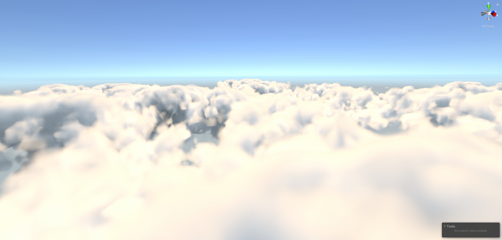

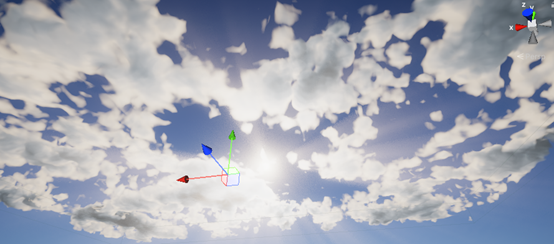

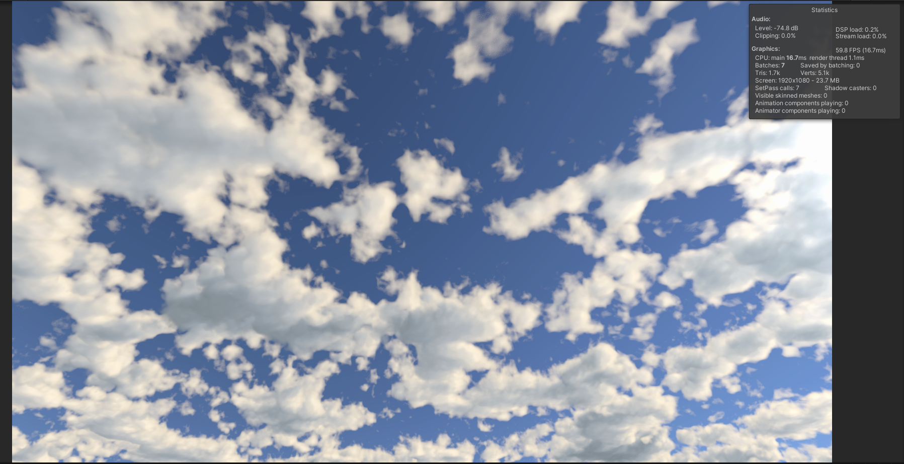

效果的实现是通过后处理方式实现，通过在后处理流程中构建世界坐标空间然后通过计算RayMarching+3D噪声实现体积云效果。目前帧数消耗确实还是比较大。s

1.RayMarching是什么：光线步进，[从摄像机向屏幕上的每一个像素发射一条光线，光线按照一定步长前进，检测当前光线距离物体表面的距离，并且根据这个距离调整光线的步长，直到抵达物体表面](https://zhuanlan.zhihu.com/p/158713630)。
- 更详细的说明&步进过程：Michael Walczyk的[Ray Marching](https://michaelwalczyk.com/blog-ray-marching.html)文章
    - 值得一提的是，SDF函数描述的是整个世界空间中传入的坐标p与最近物体的距离
        - 
        - 在这张图里面也即意味着输入的蓝点P，返回的是到最近的绿色点的距离

2.包围盒计算：
```glsl
                //边界框最小值       边界框最大值         
float2 rayBoxDst(float3 boundsMin, float3 boundsMax,
    //世界相机位置      反向世界空间光线方向
    float3 rayOrigin, float3 invRaydir)
{
    //相当于 (boundsMin - rayOrigin) / normalize(viewDir)
    float3 t0 = (boundsMin - rayOrigin) * invRaydir;
    float3 t1 = (boundsMax - rayOrigin) * invRaydir;
    float3 tmin = min(t0, t1);
    float3 tmax = max(t0, t1);

    float dstA = max(max(tmin.x, tmin.y), tmin.z); //进入点
    float dstB = min(tmax.x, min(tmax.y, tmax.z)); //出去点

    float dstToBox = max(0, dstA);
    float dstInsideBox = max(0, dstB - dstToBox);
    return float2(dstToBox, dstInsideBox);
}
```
- boundsMin：cloudTransform.position - cloudTransform.localScale / 2
- boundsMax: cloudTransform.position + cloudTransform.localScale / 2

云层范围的包围

- 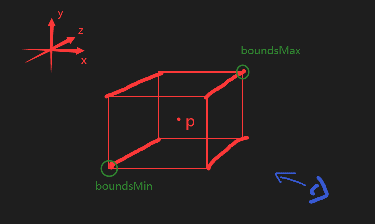
- rayOrigin：_WorldSpaceCameraPos
- invRaydir：(1 / normalize(worldPos - rayPos.xyz))

定位 相机位置 以及 相机看向物体方向向量的倒数

- 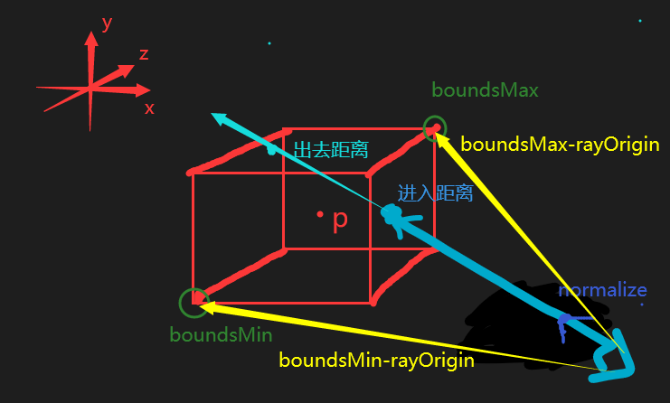


- 橙色：dstA，相机光线进入包围盒时的距离
- 红色：posWs - rayOrigin，重构的世界坐标下物体与相机的距离
- 紫色：dstB - dstA，光线在包围盒内总的路径
- 蓝色：posWS-rayOrigin - dstA，从进入点到物体顶点之间需要步进的距离

可以通过尝试带入具体的世界坐标来理解包围盒的原理，或者就记得输出的结果为：

float2 rayToContainerInfo = <b>(相机依据当前方向到包围盒的距离, 沿着方向能否进入包围盒能则大于0)</b>
- 沿着方向能否进入包围盒能则大于0 也即 返回光线在包围盒中经过的距离

详细的论文见：[A Ray-Box Intersection Algorithm and Efficient Dynamic Voxel Rendering](https://jcgt.org/published/0007/03/04/)

> 另外你可能会思考当 worldPos - rayPos.xyz 中的xy如果出现为零的情况，那1/0不就变成无穷大，normalize后传给包围盒检测的输出也将变成(0, 0)，这样怎么办？——我也想知道，但是画面上并没有问题。推测是相减的小数点精度不会刚好为0以及恢复到世界坐标的坐标点都是存在一个透视除法的过程的也就是说构建出来的坐标不会有刚好和相机坐标是相同x或y的坐标点。
- 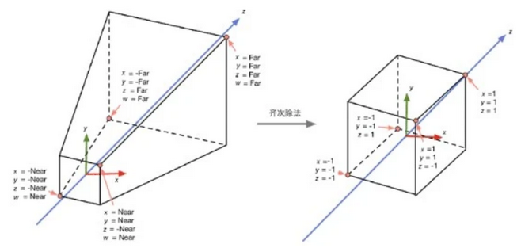
- 猜测是刚好对应在相机xy的坐标轴上不会存在坐标。

3.先绘制出包围框吧

这时候你试试把包围盒测试结果中rayToContainerInfo.y>0的片元颜色都画为white，其他都画成black，那么能够得到你的包围盒范围了。
- 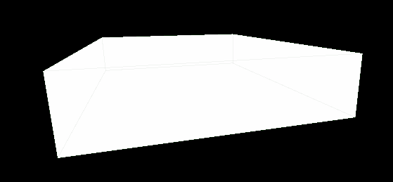
    - 浅色的灰线是不是Shader的原因，就当成全白即可


4.开始光线步进吧

在上面的过程中我们已经能够取到一下几个东西：
- dstToBox：rayToContainerInfo.x //相机到容器的距离
- dstInsideBox：rayToContainerInfo.y //返回光线在包围盒中经过的距离
- entryPoint：rayPos + worldViewDir * dstToBox，包围盒和ray的接触点坐标
- dstLimit：min(length(worldPos - _WorldSpaceCameraPos) - dstToBox, dstInsideBox)，需要步进的距离
    - min(物体到相机距离-相机沿ray方向距离包围盒距离, 相机沿ray方向在包围盒中实际经过的距离)
        - 云被物体挡住：length(worldPos - _WorldSpaceCameraPos) - dstToBox < 0，不需要步进
        - 物体被云挡住：length(worldPos - _WorldSpaceCameraPos) - dstToBox > dstInsideBox，需要把整个包围盒距离都步进掉
        - 物体在云中间：dstInsideBox > length(worldPos - _WorldSpaceCameraPos) - dstToBox > 0，只需要步进length(worldPos - _WorldSpaceCameraPos) - dstToBox距离即可

光线步进，也就是要计算沿着Ray方向，从 entryPoint -> (entryPoint+dstLimit*ray单位向量) 的过程中叠加起来的颜色的过程。我们在步进的过程中采样噪声，将噪声的结果作为云的密度来计算大气光照（一定程度等于体积云颜色结果）。


[大气光照组成](https://zhuanlan.zhihu.com/p/124297905)
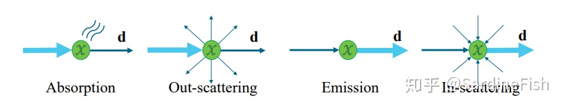
- Absorption：吸收，光线被物质吸收并由光能转化为其他能量
- Scattering：散射
    - Out-scattering：外散射，光线被介质中的微粒向外散射，散射后的部分将不进入摄像机
    - In-scattering：内散射，从其他地方散射到当前光路上的光线
- Emission：介质由于黑体辐射等因素产生自发光

>但是一般而言云的颜色计算可以被简化到 “只由<b>Absorption吸收</b>&<b>Scattering散射</b>决定”，而吸收的部分又可以通过调整散射参数来简化。所以我们最终只考虑光照中<span style="border-bottom:2px dashed red;">散射部分</span>的影响。

- Scattering组成：[参考](https://zhuanlan.zhihu.com/p/401013637)
    - [外散射]()
        - [瑞利散射](https://baike.baidu.com/item/%E7%91%9E%E5%88%A9%E6%95%A3%E5%B0%84/7665331) Rayleigh scattering
            - 来自天空的光线经过大气的瑞利散射多是蓝色，来自太阳的光线其中波长较短的蓝紫光将被散射，只有波长较长的红橙光到达人眼（人眼观察到的天空颜色多是散射光，太阳光则是直射光）
            - 公式：fr(θ) = (3/(16 *π))*(1+cos²θ)
            - 似乎在代码里没有计算这部分的
        - [米氏散射](https://baike.baidu.com/item/%E7%B1%B3%E6%B0%8F%E6%95%A3%E5%B0%84/3654256) Mie scattering
            - 水滴组成云与可见光的波长大小相当，因此云多是米氏散射造成的白色
            - 代替公式：Henyey-Greenstein phase function，HG相位函数
            - 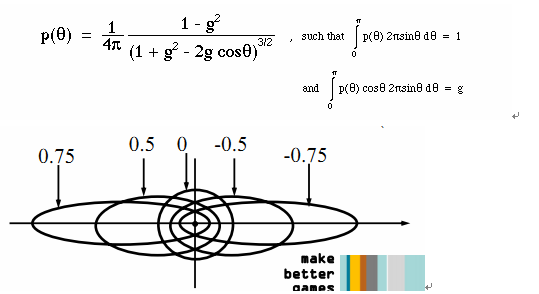
    - [内散射](https://www.jianshu.com/p/ae1d13bb0d86) 
        - In-Scattering Probability Function 内散射概率函数 - Powdered Sugar Effect
            - 从光源发出的光从其他路径折射到当前视线的量，影响光照的亮度程度
            - 本工程中猜测是lightmarch的部分，但是不是同样的写法
            - ```glsl
                powder_sugar_effect = 1.0 - exp( -light_samples *2.0 );
                beers_law = exp( -density*stepSize ) ;
                light_energy = 2.0 * beers_law * powder_sugar_effect; //PSE结果

                light_energy可以用到步进的循环里面去作为lightEnergy的累加分量
                ```


朗伯-比尔定律 是光吸收的基本定律，可以基于云的厚度来计算透光强度
- c:密度
- d:光程
- 朗伯-比尔定律 = exp(-c\*d ) = 透光强度，云层密度越大\*光程越深 则exp(-c*d)结果越小，即越难看穿云层
    - 这个值可以用来衡量当前视角看过去云的不透明程度

所以我们会在步进的过程中不断的采样噪声得到密度density然后利用density来计算大气光照散射的结果然后和原本相机颜色缓冲结合起来。

```glsl
// 与云云容器的交汇点
float3 entryPoint = rayPos + worldViewDir * dstToBox;

//相机到物体的距离 - 相机到容器的距离
float dstLimit = min(depthEyeLinear - dstToBox, dstInsideBox);

//添加抖动的贴图采样
float blueNoise = tex2D(_BlueNoise, i.texcoord * _BlueNoiseCoords.xy + _BlueNoiseCoords.zw).r;

//向灯光方向的散射更强一些
Light mainLight = GetMainLight(TransformWorldToShadowCoord(worldPos));
float cosAngle = dot(worldViewDir, mainLight.direction); //视线方向与光线方向夹角
//计算米氏散射的颜色结果
float3 phaseVal = phase(cosAngle);

float dstTravelled = blueNoise.r * _rayOffsetStrength;
float sumDensity = 1;
float3 lightEnergy = 0;
const float sizeLoop = 512;
float stepSize = exp(_step)*_rayStep;

for (int j = 0; j < sizeLoop; j++)
{
    if (dstTravelled < dstLimit)
    {
        rayPos = entryPoint + (worldViewDir * dstTravelled);
        float density = sampleDensity(rayPos);
        if (density > 0)
        {
            //从光源到当前点为止的颜色积累
            float3 lightTransmittance = lightmarch(rayPos, dstTravelled, mainLight.direction);
            //光源&云作用的累计颜色结果
            lightEnergy += density * stepSize * sumDensity * lightTransmittance * phaseVal;
            //透射系数，是个随着步进累乘变小的过程，
            //越深的云density乘完越小即变得更偏向云的颜色(偏离原本颜色)
            sumDensity *= exp(-density * stepSize * _lightAbsorptionThroughCloud);

            if (sumDensity < 0.01)
                break;
        }
    }
    dstTravelled += stepSize;
}
//当前点原本的颜色
float4 color = SAMPLE_TEXTURE2D(_CameraColorTexture, sampler_CameraColorTexture, i.texcoord); 
float4 cloudColor = float4(lightEnergy, sumDensity); //(光照的颜色, 原色保持程度也即透射系数)

color.rgb *= cloudColor.a; //透过率越大则原本颜色越能维持
color.rgb += cloudColor.rgb; //然后加上光照颜色
```

总的来说，一方面是要算云累计步进算出的颜色、另一方面是要算云累计步进算出来的透射度；然后将算出来的颜色基于投射度来和原本的相机颜色做混合。

本工程考虑了的大气光照成分：
- 内散射：光源方向累计-lightmarch函数
- 外散射：米氏散射-phase函数
- 透射强度：朗伯比尔定律-exp(-density*stepSize)
    - 结果是步进累积的，即sumDensity *= exp(-density*stepSize)，每步进一次都会累乘一次，于是云越深的地方透射系数越小
- 利用sumDensity作为云颜色和相机缓冲的混合系数

----

## CrepuscularRay - 体积光/黄昏光效果

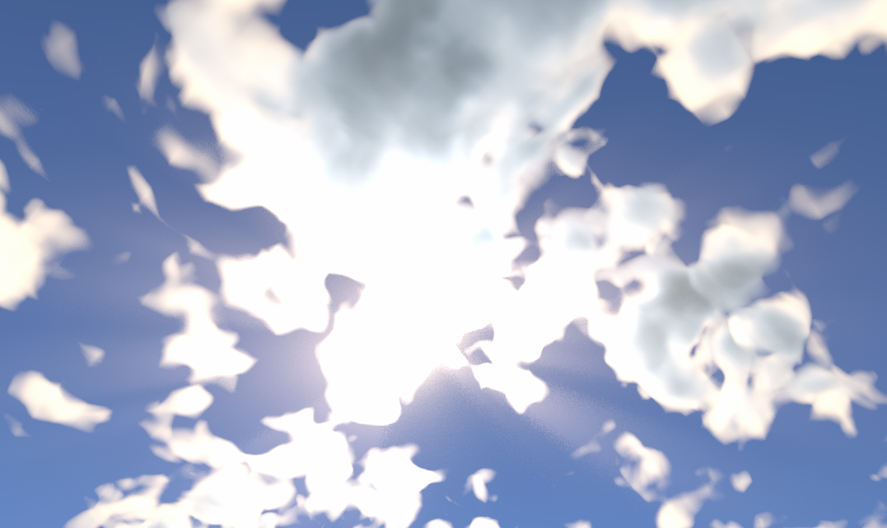

体积光的效果原理：
- 计算出光源的UV位置，然后在片元遍历的过程中计算当前遍历的UV点和光源UV的差距点。这个差值的大小由UV点与光照UV点的距离呈现正相关，是个float2类型的向量表示画面UV与光源UV的相对距离。

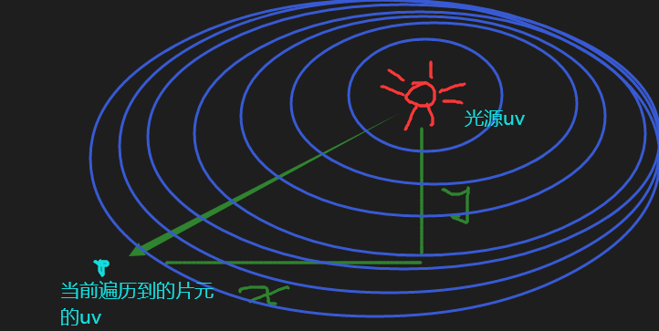

- 在屏幕空间UV上一层层的的偏移量，偏移量是lightViewDir = length(ScreenUv)计算得到，可以根据偏移量来控制体积光范围的淡出。

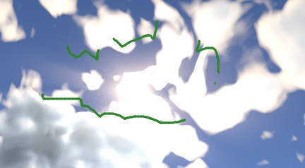

- 通过原本贴图颜色转为亮度的形式来控制哪些地方会有光束，原理就是云的白色比天空的蓝色在转为亮度后值更大，于是能够出现只有云的地方才出现光束。并且通过从光源开始偏移UV，使得云的颜色转为的亮度能如上图那样一圈圈的往外变成体积光。

- 然后根据距离的长度来作为光照的影响程度，结合光照颜色叠加到原图像上，就是体积光效果

```glsl
float4 Frag(VaryingsDefault i ):SV_Target
{
    //原本的相机颜色
    float4 color = SAMPLE_TEXTURE2D(_MyCameraColorTexture, sampler_MyCameraColorTexture, i.texcoord);

    //背面消隐，如果是背光面则会越暗
    float backDir = saturate(dot(-_LightDir,_CamDir)); //相机和光照反方向点乘，表示背光强度

    float2 ScreenUv = _LightViewPos.xy -  i.texcoord; //模糊向量，当前的UV采样的点距离光源的UV坐标越远则lightViewDir越大
    float lightViewDir = length(ScreenUv); //与光源的xy距离
    float distanceControl = saturate(_RayRange - lightViewDir); //_RayRange控制距离到多远的部分还能够有影响

    float3 colorFinal = float3(0,0,0); 
    float2 originalUV = i.texcoord;

    float2 ScrUV = ScreenUv * OffsetUV; //控制偏移量
    float2 jitter = random(i.texcoord); //随机偏移

    //循环叠加光照效果
    for (int ray = 0;ray<qualityStep; ray++)
    {
        //降低分辨率后进行随机UV偏移
        float3 Addcolor = SAMPLE_TEXTURE2D(_LowResTexture, sampler_LowResTexture,originalUV + jitter * 0.005f).rgb;
        //_LightThreshold控制阈值，会隔离掉一部分的颜色
        float3 thresholdColor = saturate(Addcolor - _LightThreshold) * distanceControl; 
        float luminanceColor = dot(thresholdColor,float3(0.3f,0.59f,0.11f)); //将颜色强度转为灰度
        luminanceColor = pow(luminanceColor, _RayPower); //pow处理
        //luminanceColor *= sign(saturate(lindepth - _DepthThreshold));
        colorFinal += luminanceColor; //光照增加
        originalUV += ScrUV ; //UV偏移
    }
    colorFinal = (colorFinal/qualityStep) * LightColor.rgb * _RayIntensity; //求每步的平均值*灯光颜色*强度

    return float4((colorFinal * backDir),1) + color; //额外光效果+原本相机颜色
}
```

具体步骤：

- 先求屏幕UV偏移量的向量
- 求偏移向量的长度作为距离光源的参考
- 偏移量的长度控制光照的范围&光照的强度系数之一
- 将原本相机颜色缓冲的颜色算为亮度
- 亮度作为光照颜色和原本颜色的混合系数之一
- 亮度平均下来之后\*光源颜色\*强度=光照结果
- 光照结果+原本相机颜色=混合结果

伪代码：

```c#
float3 原始相机采样颜色 = 采样贴图(相机颜色缓冲, 屏幕当前UV); //用来在最后和计算的光照结果做合成
float2 偏移向量 = 屏幕当前UV - 光源点UV; //计算与光源点的距离
float 偏移量 = 求长度(偏移向量);
float 背光度 = dot(-光源方向, 相机视线方向); //背光程度
float 显示范围 = saturate(外部控制的光照范围 - 偏移量);

float3 最终光照颜色 = (0,0,0); //只用来记录光照的叠加
float2 要变换的UV = 屏幕当前UV;

float2 屏幕偏移度 = 偏移向量 * 偏移系数; //控制每次UV偏移增量
float2 UV随机偏移 = UV随机变换;

Loop 外部控制循环叠加次数{
    float3 相机本次循环采样颜色 = 采样贴图(相机颜色缓冲, 要变换的UV + UV随机偏移);
    float3 颜色阈值 = saturate( 相机本次循环采样颜色 - 外部控制的颜色限度 ) * 显示范围;
    float 亮度 = 计算亮度(相机本次循环采样颜色);
    亮度 = pow(亮度, 亮度系数);

    最终光照颜色 += 亮度;
    要变换的UV += 屏幕偏移度;
}

最终光照颜色 = (最终光照颜色 / 循环叠加次数) * 光源颜色 * 外部控制的光照强度;
return float4(最终光照颜色*背光度, 1) + 原始相机采样颜色; //混合后的最终颜色
```
